# iPhone Cases Price Comparison Application

A comprehensive price comparison web application that scrapes iPhone case data from multiple e-commerce websites and provides users with a unified interface to compare prices, features, and availability across different retailers.

## 🎯 Project Overview

This application consists of three main components working together to provide a seamless price comparison experience:

1. **Web Scraping Service** (Java) - Collects product data from multiple e-commerce sites
2. **REST API Backend** (Node.js/Express) - Serves scraped data through RESTful endpoints
3. **Frontend Web Application** (Vue.js) - User-friendly interface for browsing and comparing products

## ✨ Key Features

- **Multi-retailer Price Comparison**: Compare iPhone case prices across Amazon, eBay, BestBuy, Backmarket, and Argos
- **Smart Search**: Search by iPhone model to find compatible cases
- **Product Details**: Detailed product pages with images, specifications, and pricing
- **Responsive Design**: Mobile-first responsive interface
- **Featured Products Carousel**: Highlight popular and discounted items
- **Pagination**: Efficient browsing through large product catalogs
- **Real-time Data**: Regularly updated product information through automated scraping

## 🏗️ Architecture

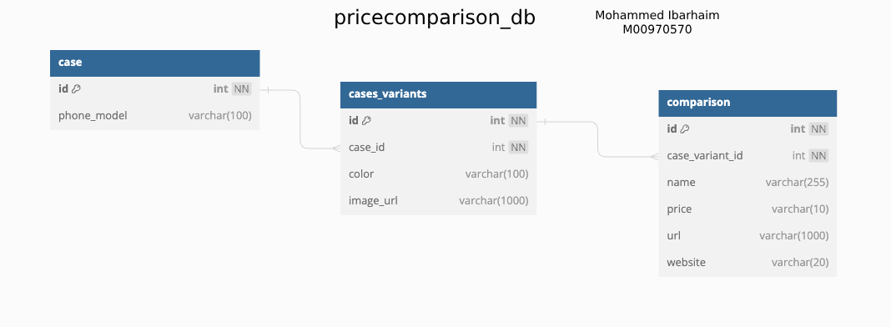

### System Architecture

```
┌─────────────────┐    ┌──────────────┐    ┌─────────────────┐
│   Web Scraping  │────│    MySQL     │────│   Web App       │
│   (Java/Maven)  │    │   Database   │    │ (Node.js/Vue.js)│
└─────────────────┘    └──────────────┘    └─────────────────┘
```

## 🛠️ Technology Stack

### Frontend

- **Vue.js 2.7.8** - Progressive JavaScript framework
- **HTML5/CSS3** - Modern web standards
- **Responsive Design** - Mobile-first approach
- **Live Server** - Development server

### Backend API

- **Node.js** - JavaScript runtime
- **Express.js** - Web application framework
- **MySQL2** - Database connectivity
- **CORS** - Cross-origin resource sharing
- **Yarn** - Package management

### Web Scraping Service

- **Java 8** - Programming language
- **Maven** - Build automation and dependency management
- **Spring Framework** - Enterprise application framework
- **Hibernate ORM** - Object-relational mapping
- **Selenium WebDriver** - Browser automation
- **JSoup** - HTML parsing
- **JUnit 5** - Testing framework
- **Mockito** - Mocking framework

### Database

- **MySQL** - Relational database management system

## 🚀 Getting Started

### Prerequisites

- **Java 8 or higher**
- **Node.js 16 or higher**
- **MySQL 8.0 or higher**
- **Maven 3.6 or higher**
- **Yarn package manager**

### Installation

#### 1. Clone the Repository

```bash
git clone https://github.com/MHMDHIDR/Advance-Webdev-Final-Coursework-1.git
cd Advance-Webdev-Final-Coursework-1
```

#### 2. Database Setup

1. Install and start MySQL server
2. Create a new database for the project
3. Update database configuration in `WebScraping/src/main/resources/hibernate.cfg.xml`

#### 3. Web Scraping Service Setup

```bash
cd WebScraping
mvn clean compile
mvn test  # Run tests to verify setup
mvn exec:java  # Run the scraping service
```

#### 4. Backend API Setup

```bash
cd WebApp/backend
yarn install
yarn dev  # Start development server on port 4000
```

#### 5. Frontend Setup

```bash
cd WebApp/frontend
# No installation needed - uses CDN resources
# Start with live-server on port 8080
```

#### 6. Start All Services

From the root directory:

```bash
cd WebApp
yarn install
yarn dev  # Starts both backend and frontend concurrently
```

## 🖥️ Application Screenshots

### Landing Page

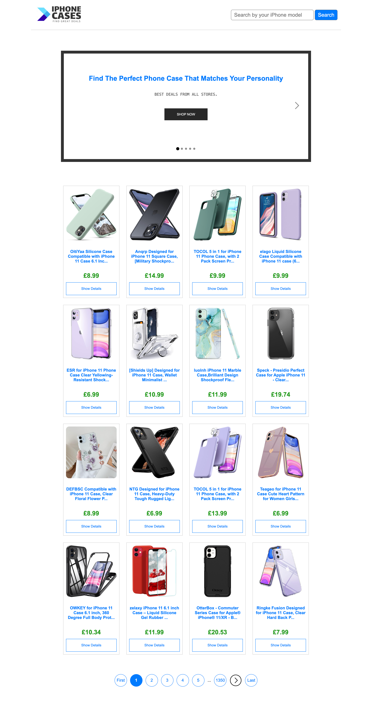

### Search Results

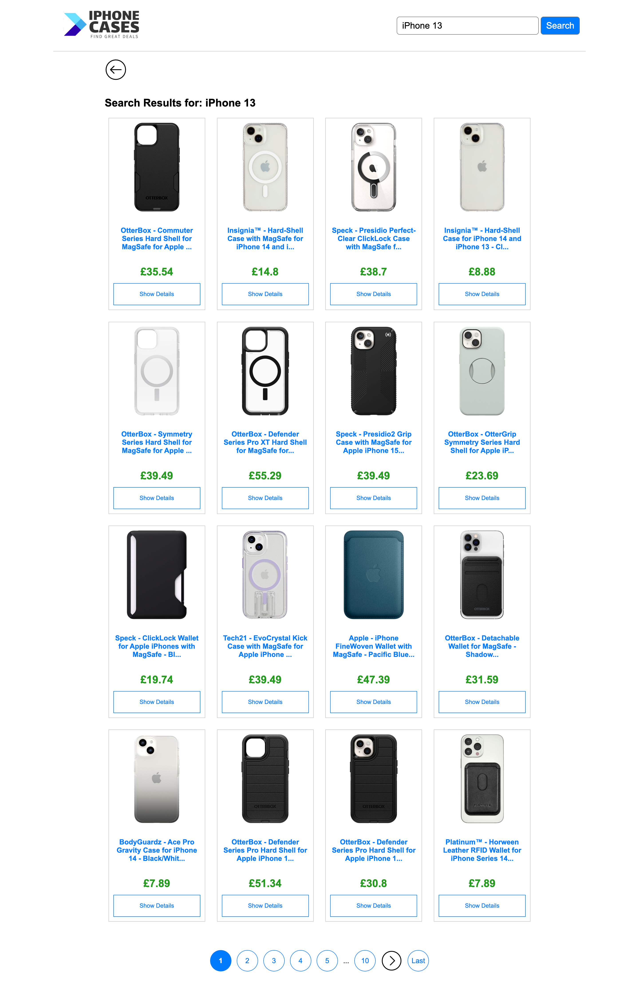

### Product Comparison

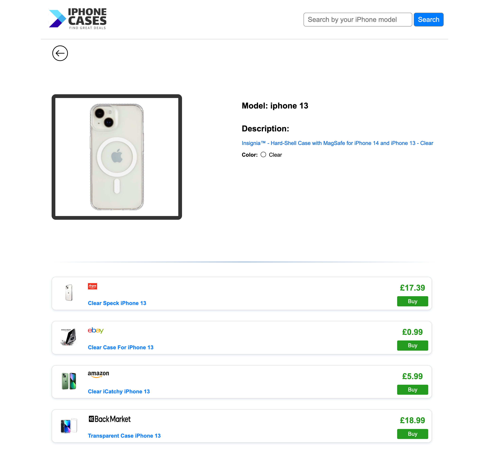

### Pagination - Landing

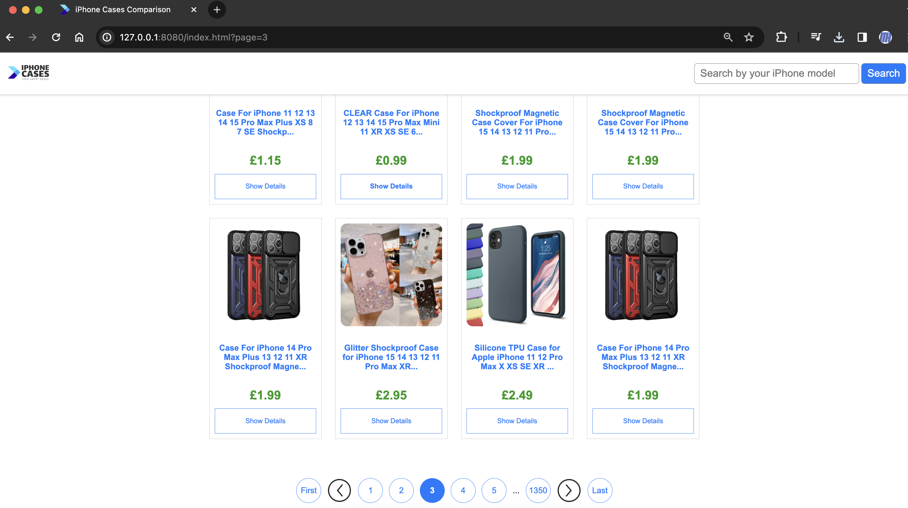

### Pagination - Search

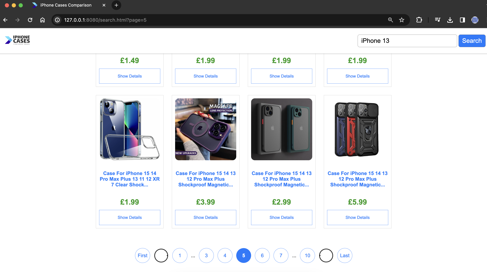

## 🧪 Testing

The application includes comprehensive test suites for all components:

### Web Scraping Tests

- **Amazon Scraper Test**: 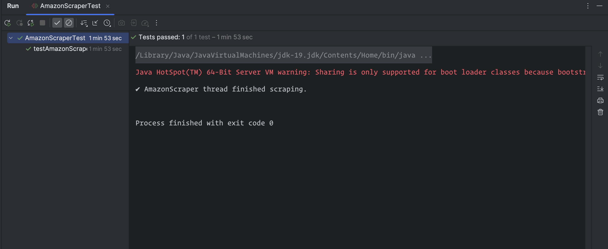
- **eBay Scraper Test**: 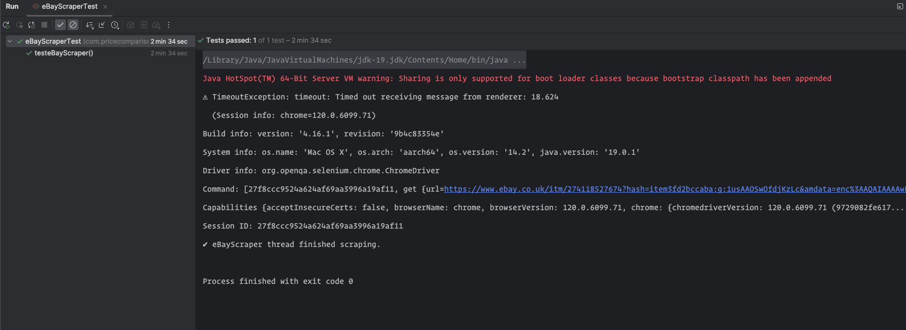
- **BestBuy Scraper Test**: 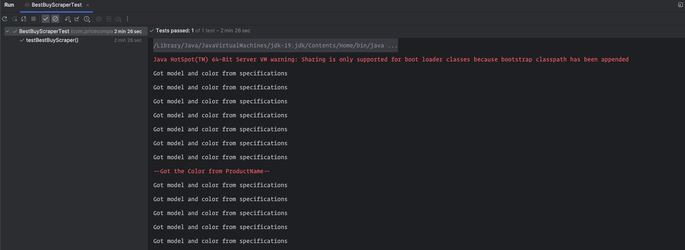
- **Backmarket Scraper Test**: 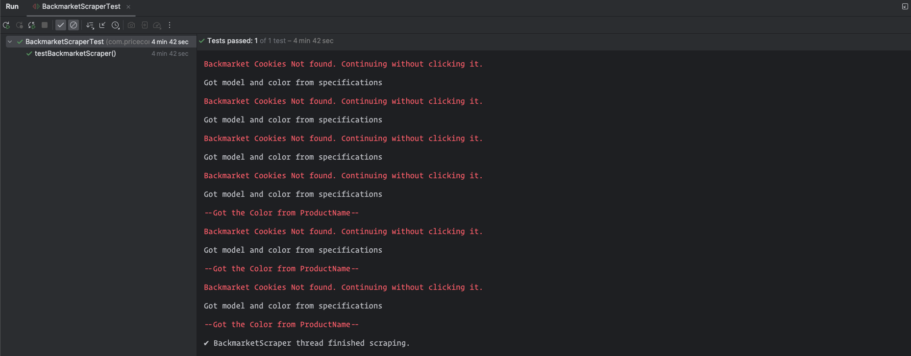
- **Argos Scraper Test**: 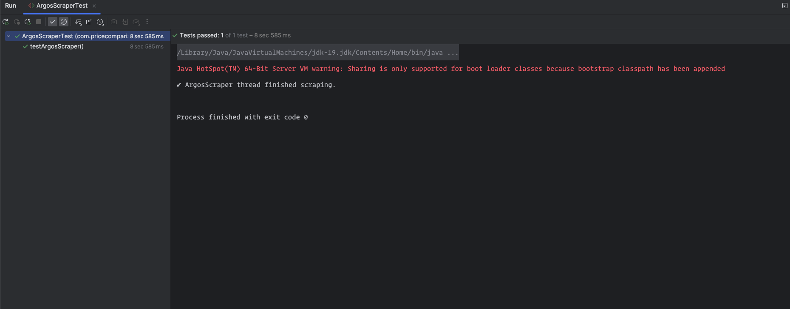
- **Database DAO Test**: 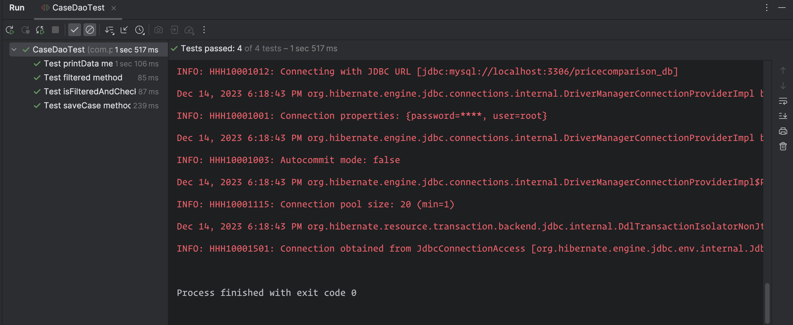

### API Tests

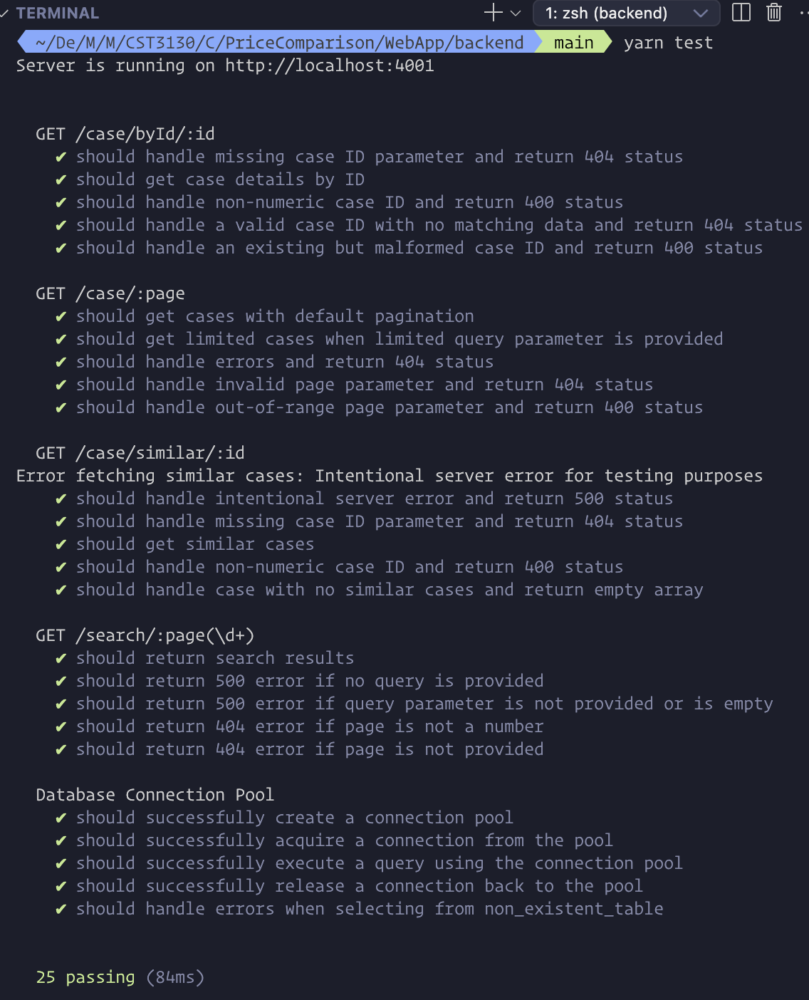

### Running Tests

#### Java Tests

```bash
cd WebScraping
mvn test
```

#### Backend API Tests

```bash
cd WebApp/backend
yarn test
```

## 🗄️ Database Schema

The application uses a MySQL database with the following main entities:

- **Cases**: Product information including name, price, images, and specifications
- **Retailers**: Store information and source URLs
- **Categories**: Product categorization
- **Variations**: Different models, colors, and specifications

See the [Database Diagram](final_database_diagram.jpg) for detailed schema relationships.

## 📚 API Documentation

### Base URL

```
http://localhost:4000
```

### Endpoints

#### Cases

- `GET /case?page={page}&limited={limit}` - Get paginated cases
- `GET /case/{id}` - Get specific case by ID
- `GET /case/similar/{id}` - Get similar cases

#### Search

- `GET /search?query={searchTerm}&page={page}` - Search cases by term

### Example Response

```json
{
  "id": 1,
  "name": "iPhone 14 Pro Clear Case",
  "price": "29.99",
  "image_url": "https://example.com/image.jpg",
  "retailer": "Amazon",
  "model_compatibility": "iPhone 14 Pro",
  "color": "Clear"
}
```

## 🔧 Configuration

### Environment Variables

Create appropriate configuration files for:

#### Backend (`WebApp/backend/.env`)

```env
PORT=4000
DB_HOST=localhost
DB_USER=your_username
DB_PASSWORD=your_password
DB_NAME=price_comparison
```

#### Web Scraping (`WebScraping/src/main/resources/hibernate.cfg.xml`)

```xml
<property name="hibernate.connection.url">jdbc:mysql://localhost:3306/your_database</property>
<property name="hibernate.connection.username">your_username</property>
<property name="hibernate.connection.password">your_password</property>
```

## 🚦 Usage

### For End Users

1. Visit the application at `http://localhost:8080`
2. Browse featured products on the landing page
3. Use the search bar to find cases for specific iPhone models
4. Click on products to view detailed information
5. Compare prices across different retailers

### For Developers

1. Use the scraping service to collect fresh data from e-commerce sites
2. Access the REST API to integrate with other applications
3. Modify scrapers to add new retailer sources
4. Customize the frontend interface for different use cases

## 🔄 Development Workflow

1. **Data Collection**: Run Java scrapers to collect product data
2. **Data Storage**: Product information is stored in MySQL database
3. **API Service**: Node.js backend serves data through REST endpoints
4. **User Interface**: Vue.js frontend provides interactive user experience

## 📈 Performance Considerations

- **Caching**: Implement caching strategies for frequently accessed data
- **Rate Limiting**: Respect retailer website policies during scraping
- **Database Indexing**: Optimize database queries with proper indexing
- **Responsive Design**: Ensure fast loading on mobile devices

## 🤝 Contributing

1. Fork the repository
2. Create a feature branch (`git checkout -b feature/AmazingFeature`)
3. Commit your changes (`git commit -m 'Add some AmazingFeature'`)
4. Push to the branch (`git push origin feature/AmazingFeature`)
5. Open a Pull Request

## 📝 License

This project is part of an academic coursework for Advanced Web Development.

## 👥 Authors

- **Mohammed Haydar** - Initial work and development

## 🙏 Acknowledgments

- E-commerce websites for providing product data
- Open source libraries and frameworks used in this project
- Academic institution for project requirements and guidance

---

_For detailed technical documentation, see individual component README files in their respective directories._
